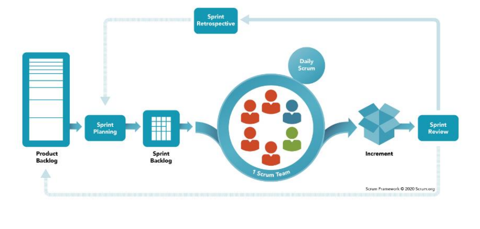
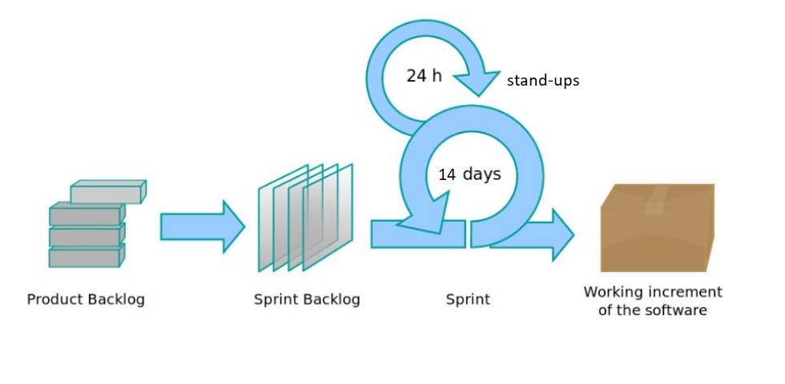

# Plan of Approach

*Version Number: 0.1* 
## Table of content
  - [1. Introduction](#1-introduction)
  - [2. Stakeholders](#2-stakeholders)
  - [3. Project objectives](#3-project-objectives)
  - [4. Explanation of work process](#4-explanation-of-work-process)
      - [4.1 Scrum plan of actions for the entire project:](#41-scrum-plan-of-actions-for-the-entire-project)
  - [5. Research methodology](#5-research-methodology)
  - [6. Technologies Used](#6-technologies-used)
    - [6.1. Frontend](#61-frontend)
    - [6.2. Backend](#62-backend)
  - [7. Kick-off meeting](#7-kick-off-meeting)
  - [8. Collaboration conduct](#8-collaboration-conduct)
    - [8.1. General day hours](#81-general-day-hours)
    - [8.2. Special meeting days](#82-special-meeting-days)
    - [8.3. Communication channel](#83-communication-channel)
    - [8.4. Time logging](#84-time-logging)
    - [8.5. Client meetings](#85-client-meetings)
      - [8.5.1. Communication channel](#851-communication-channel)
      - [8.5.2. Project team meeting (client + SSS students + ICT students)](#852-project-team-meeting-client--sss-students--ict-students)
      - [8.5.3. Client meeting (client + ICT students)](#853-client-meeting-client--ict-students)
    - [8.6 Sprint deliverables](#86-sprint-deliverables)
    - [8.7. Communication between the meetings](#87-communication-between-the-meetings)
    - [8.8 Quality management](#88-quality-management)
      - [8.8.1. Definition of done](#881-definition-of-done)
      - [8.8.2 Testing plan](#882-testing-plan)
      - [8.8.3. Reviewing plan](#883-reviewing-plan)
  - [9. Global Timeline](#9-global-timeline)
  - [10. Sprint objectives](#10-sprint-objectives)
    - [10.1 Sprint 0](#101-sprint-0)
    - [10.2. Sprint 1](#102-sprint-1)
    - [10.3. Sprint 2](#103-sprint-2)
    - [10.4. Sprint 3](#104-sprint-3)
  - [11. Risk analysis](#11-risk-analysis)
    - [11.1. Communication](#111-communication)
    - [11.2. Technology](#112-technology)
    - [11.3. Budget](#113-budget)
    - [11.4. Health issue](#114-health-issue)
  - [12. HBO-i competence levels](#12-hbo-i-competence-levels)
    - [12.1. Selected competence levels](#121-selected-competence-levels)

 
## 1. Introduction 

With the growth of digitisation and tourism, convenience is becoming increasingly important. Although there are many mapping applications most of them have the goal to simply get a user from point A to point B, without taking in consideration of the user experience preference.
 
The goal of this project is to address these issues by creating a personalized experience for locals and tourists via a mapping application that creates user preference based routes which relies on the products they are searching or local events they might want to attend to. Alongside, the app aims to give the user an insight of the local business/event by providing descriptions of the places which will help them to determine if the business/event is what they are looking for.

This project has a duration of 8 working weeks, and will be overseen by a team of 5 members:

| Member name     | Role                                                        | Contact                  |
|-----------------|-------------------------------------------------------------|--------------------------|
| Craig Chauraya  | Full-stack developer/ Scrum Master Sprint 2                 | 500215@student.saxion.nl |
| Minh Pham       | Full-stack developer/ Git manager/ Scrum Master Sprint 1    | 491537@student.saxion.nl |
| Vedat Daglar    | Full-stack developer/ Client Liaison/ Scrum Master Sprint 3 | 495701@student.saxion.nl |
| Andrei Lidzhiev | Full-stack developer, Product Owner                         | 480211@student.saxion.nl |
| Daria Grigoruk  | Full-stack developer                                        | 486702@student.saxion.nl |

This project is also a part of the Smart Solution Semester project (more details can be found in the [project page](https://market.saxion.nl/projects/125-improve-city-centre-environment-for-consumers/)).

## 2. Stakeholders

 - **Client** - Nils, our client, person who has a vision of the project and who makes all decisions regarding product's form and idea. He is the contact point in case we have doubts or question regarding app's core functionality or other important topics.

 - **Technical Partner** - client's partner, Arne, person who made a software for the customer before and who will assist us during the development. We will contact Arne in case of technical issues or questions about architecture or API.

 - **SSS students** - team of Smart Solutions Semester students, they have worked on shaping the original idea into more specific design, with wireframes and documentation, they will assist us in the development and also testing the iterations of the product, providing us with a feedback. We will discuss visual design, functionality and user experience related questions with SSS team, also involving Nils into the discussion, when necessary.

 - **Developers** - us, we are the ones who will work on enhancing existing design, implementing new software, and connecting it to the database provided by Technical partner.

 - **Walstraat shops** - as client said, some organizations and entrepreneurs agreed to be a part of testing environment. We can use the information of their facilities and depict it in our web app.
 

## 3. Project objectives

Previous studies have shown that the city of Deventer needs digitization to meet the needs of tourists, residents of the city and the development of small businesses.
To test one of the possible solutions of this problem, a section of the city center of Deventer was chosen (Walstraat) and it was decided to create a Web application for smartphones that includes all the features that can help tourists, locals and local entrepreneurs achieve a common goal, digitize current offerings, make them visible to attract more tourists to city center, make life for locals easier and help new entrepreneurs.
It was decided to release a web application for smartphones with GPS that works with constantly updated data on Walstraat and helps to easily find the desired point on the map, see the information the user needs about it and build an effective route to this point, this application should be ready by the June 26 2022.
In order to achieve the main goal of the project, it was divided into several periods in which specific goals had to be achieved:
* Until May 29, 2022, A tourist or a local resident may be able to see the latest data on offers (special promotions from companies) on Walstraat and make route till it, to achieve this, an application must be created which should provide the ability to build a route from the user's current location to a selected point on WallStreet.

* Until June 12, 2022, a tourist or a local resident can get the opportunity to see his favorite routes and plans for visiting different places on the Street on different days or at different times (agenda). To implement it the Webapp has to have ability for user to register an account and log in to his personal account where will be store all his personal preferences and agenda.Thus, during this period of time, the application must include the function of registering, logging into an account and storing a history of user actions.

* Until June 26, 2022, a tourist or a local resident can build complex routes allowing him to optimally visit all the points he has chosen on the map. To achieve this, it is necessary that our application allows to build the best route between several points on the map.

## 4. Explanation of work process

In order to quickly achieve the goals of the project and work effectively in a team, it was decided to use the Scrum project management methodology. Thus, all team members were distributed according to roles, namely Scrum master (every Sprint different), Scrum development team (all team members), Product owner (Andrei Lidzhiev).
And the whole project was divided into clearly regulated time intervals (Sprints, 2 weeks each sprint), overall 4 Sprints: Sprint-0(plan and research) and Sprints-1,2,3 (implementation of WebApp). After each Sprint the product increment should be released and presented to the Client in form of documentation, presentation(for Sprints: 0,1,2,3) and Demo (for Sprints: 1,2,3).

#### 4.1 Scrum plan of actions for the entire project:

1) From the goal of the project, a list of requirements is formed (Product backlog). **Beginning of Scrum process for entire project (Figure 1)**;

2) The team at the general meeting on the end of Sprint-0 breaks down the task into several stages (Sprint
   Backlogs) to be completed over a period of time (Sprint).
3) Next comes the planning of the Sprint, where goals are selected, tasks (Backlog items) are distributed between
   the Scrum development team. **Beginning of Scrum process for the Sprint (Figure 2)**;
4) 5 days per week at 10 a.m. the development team will have daily Scrums stand-up, where everyone has to declare what he has done and what he is going to do next;
5) In the process of implementing each stage, there is a so-called increment in the value of
   the product , which has to be represented to Client;
6) The Scrum team analyzes the results and makes corrections for the next sprint (Sprint
   Review, Sprint Retrospective). **End of Scrum process for the Sprint**;
7) Repeating the cycle of actions from number 3 until the entire task is completely
   finished **(End of Scrum process for entire project)**.

Figure 1. Scrum process for entire project:
   

Figure 2. Scrum process for every Sprint:

## 5. Research methodology

All the researches that were conducted are following the [DOT framework](https://ictresearchmethods.nl/The_DOT_Framework).

## 6. Technologies Used

(Saying we will perform multi-criteria analysis for the most important technical decision, referencing to research/technical documentation)

### 6.1. Frontend

* __React__: React is a fast, component based Javascript framework which is used for developing SPAs. This makes it great for creating data visualization tools like GPS systems since it prevents the need to reload the page every time there will be a change in the map, for instance.  
  
* __Next.js__: Next.js is an open-source development framework built on top of Node.js enabling React based web applications functionalities such as server-side rendering and generating static websites.

* __Tailwind CSS__: For CSS we are using Tailwind. Tailwind is utility based CSS framework which provides functionality to create highly customizable styling.

### 6.2. Backend 

* __Node.js__:  By using Node.js, we will be able to use the same programming language, Javascript, across the stack. Also, with Node.js we will also have access to the npm software library which might be useful in the future.

* __Express.js__: Express is a web-app framework which provides various features such as middleware, creating HTTP requests and routing.  

* __Geolocation__: The Geolocation API allows the user to provide their real-time location via the web application they are using. We are using this API to constantly access the users location in order to display it on the map component later on.

## 7. Kick-off meeting

On the first day of the project, we had a meeting with our client and SSS students at Saxion and we had a small trip to Walstraat, where the application will be tested. Together, we shared common knowledge about the project, discussed the project's scope and objectives, and planned for the weekly team meeting and working methodology.

## 8. Collaboration conduct

The following dates are agreed by the team as to when to meet and for what purpose. 

### 8.1. General day hours

The table below shows the usual times we agreed to meet:

|    Day     | Time (Start)  |   Time (End)    |Venue (online or onsite) |
|:----------:|:-------------:|:---------------:|:-----------------------:|
|   Monday   |   10:30 am    |     4:30 pm     |         Onsite          |
|  Tuesday   |   10:30 am    |     5:30 pm     |         Online          |
| Wednesday  |    8:30 am    |     1:00 pm     |         Onsite          |
|  Thursday  |   10:30 am    |     5:00 pm     |         Onsite          |
|   Friday   |   10:30 am    |     4:30 pm     |         Online          |

### 8.2. Special meeting days

There are days when the team meets up for special meetings such as client meetings scrum sprint planning etc. 
The days detailed below gives a brief description about when of such meetings are done.

<ul>

**<li>Scrum Sprint planning</li>** - This is done on the **last Friday before the end of the current Sprint**.

This meeting is for planning on what to do to cover the next user stories for the next sprint.

**<li>Scrum Sprint Retrospective</li>** - This is done on the **last Friday before the end of the current Sprint**.

This meeting is for assessing what was planned in the last Scrum Sprint Planning, what was done so far, what was the overall team progress and motivation during that sprint and what to do to improve progress during the next sprint.

**<li>Scrum sprint backlog refinement</li>** - This is done on the **last Thursday before the end of the current Sprint**.

This meeting is for analysing the user stories nominated for the next sprint.
 Adding weights to each backlog item as well as giving each of them a well described acceptance criteria and reviewer before they are finalised on Friday during the Sprint Planning meeting.

**<li>Client meetings</li>** - This is done **every Monday and Friday** however only **project progression demos and presentations** are done on the **last Friday before the current sprint ends** and the **Monday that is at the beginning of the next sprint**.

During the casual Friday meetings we will be giving the Client a brief update as to what to expect by the end of the sprint and the overall progression of the project.

During the last Friday of the current sprint meetings we will be presenting a well detailed presentation about what was planned to be done during that sprint, what was done and what will be done during the next sprint as well as a short demo showcasing the current functionality of the application. 
Also deliverables will be handed out to the client as mentioned in the Global Timeline section of this document.

During the first Monday of the new sprint meeting we will be showcasing the same presentation and demo to the rest of the clients because of the joint client and developer meetings we have every Monday.

</ul> 
  
### 8.3. Communication channel

The main channel for communication is through Discord. A WhatsApp channel is also available for those who are not able to use Discord.

### 8.4. Time logging

The team has an Excel sheet on OneDrive for logging their work timings. Each team member is required to fill in the time sheet at the end of each working day (Mon-Fri). The format for logging time on the sheet is as:

 
     <GITLAB_ISSUE_NUMBER> : <ISSUE_NAME>

     (Example)  US14-BL03: Add sign up button

 The timings for the work made in the weekends can be filled in on Mondays, at the end of the day alongside Mondays work timing. 

### 8.5. Client meetings

#### 8.5.1. Communication channel

The main channel for communication is through Discord. A WhatsApp channel is also available for those who are not able to use Discord. 
Discord is being used for contacting Nils, while WhatsApp is for contacting SSS students.

#### 8.5.2. Project team meeting (client + SSS students + ICT students)

Every Monday, the project team will have a physical meeting where the development team will report the project's progress and discuss any issues that might arise during the development process. 

A demo session and Sprint kick-off will be held on the first working day of the Sprint. First, the development team will have a demo session with the client and SSS students. Afterwards, the whole team will discuss and plan for the Sprint objectives.

#### 8.5.3. Client meeting (client + ICT students)

Every Friday, the development team will have an online meeting with the client to discuss the project's progress and discuss any issues that might arise during the development process. 

### 8.6 Sprint deliverables 

In the end of every sprint (last Friday) we will deliver the client a current build of the application which can be used for testing and evaluation. We will also provide a sprint planning document for the upcoming sprint, so that the client is able to see in what direction we are going and what he can expect.

### 8.7. Communication between the meetings

We are able to contact the client outside of the meeting time as well, we will use that opportunity to inform the client about major changes of the plan, manage the expectations of what we are going to deliver in the end, ask questions and discuss important decisions regarding the sprint delivery. 

### 8.8 Quality management

To ensure the quality of work is maintained, a testing plan and reviewing plan are created to ensure that the backlog item is done in a manner that is consistent with the definition of done.

#### 8.8.1. Definition of done

The Definition of Done is an agreed-upon set of items that must be completed before a project or user story can be considered complete. It is applied consistently and serves as an official gate separating things from being “in progress” to “done.”

The team has agreed upon the definition of done for the project. The following is a list of criterion that must be completed before a project or user story can be considered complete:
- All the backlog items belonging to the user story are completed.
- All the backlog items belonging to the user story are reviewed and tested according to the test plan.
- All the backlog items belonging to the user story are merged to the "main" codebase.

#### 8.8.2 Testing plan

The testing plan is a document that outlines the testing activities that are required to be performed on the backlog item. Each backlog item will have a different set of testing activities to be conducted. 

Detailed information about the testing activities can be found in the [Test Plan](test-plan.md) document.

#### 8.8.3. Reviewing plan

For every backlog item, a team member will be assigned to review the work of the author by following the testing plan for that backlog item. The reviewer has the following responsibilities:
- Review the definition of done for the backlog item
- Testing the backlog item by following the test activities in the testing plan
- Approve the issue if the backlog item is done according to the definition of done. The backlog issue must go through the approval of the assigned reviewer before it can be merged to the target branch.
- Merge the issue to the target branch after the issue is approved

## 9. Timeline

### 9.1. Deliverables timeline

| Date           | Deadlines     | Deliverables                                                                                                                                                                              |
|----------------|---------------|-------------------------------------------------------------------------------------------------------------------------------------------------------------------------------------------|
| **15-05-2022** | **Sprint 0**  | **<ul><li>Plan of Approach</li></ul>**                                                                                                                                                    |
| **29-05-2022** | **Sprint 1**  | **<ul><li>Retrospective report Sprint 1</li><li>All produced material</li><li>Sprint 2 plan</li><li>Timesheet version 1</li><li>Account of individual contribution version 1 </li></ul>** |
| **12-06-2022** | **Sprint 2**  | **<ul><li>Retrospective report Sprint 2</li><li>All produced material</li><li>Timesheet version 2</li><li>Account of individual contribution version 2</li><li>Sprint 3 plan</li></ul>**  |
| **26-06-2022** | **Sprint 3**  | **<ul><li>Retrospective report Sprint 3</li><li>All produced material</li><li>Timesheet version 3</li><li>Account of individual contribution version 3</li></ul>**                        |

### 9.2. Global timeline 
| Date | Event |
|------|-------|
| **25-04-2022** | **Project kickoff** |
| **29-04-2022** | **Meeting with Nils for updating progress** |
| **09-05-2022** | **Meeting with project team for updating progress** |
| **13-05-2022** | **Meeting with Nils for updating progress, sprint 1 planning** |

## 10. Sprint objectives 

### 10.1 Sprint 0

For sprint 0, our team focuses on writing the Plan of Approach and forming requirements for the project. We will define the project's scope, goals, the global timeline and deliverables, as well as the objectives for each sprint of the project.

### 10.2. Sprint 1

For sprint 1, we will focus on making the core functionalities related to navigation system of the application. 
We plan to finish those user stories in this sprint:
- **Cu01**: As a consumer user, I want to see the map of Walstraat so that I can be able to navigate around the area. 
- **Cu02**: As a consumer user, I want to read a brief description about the selected location so that I know a bit more about the location of interest. 
- **Cu04**: As a consumer user, I want to see a direct route to my location of interest so that I can navigate towards it. 
### 10.3. Sprint 2

For sprint 2, we finalize the core functionalities of the application, which are the user authentication, personal account management, and information provision on different events and locations.
The user stories we are planning to implement in this sprint are:
- **Cu02**: As a consumer user, I want to read a brief description about the selected location so that I know a bit more about the location of interest. 
- **Cu03**: As a consumer user, I want to view a list of destinations that is have promotions and discounts in Walstraat so that I can easily select the one I wish to visit and use the promotion. 
- **Cu04**: As a consumer user, I want to see a direct route to my location of interest so that I can navigate towards it. 
- **Cu05**: As a consumer user, I want to see all organisations that have a promotion on offer so that I can go to the place to utilise the promotion. 
- **Cu06**: As a consumer user, I want to see all the upcoming events in Walstraat so that I can plan on what to do and when. 
- **Cu07**: As a consumer user, I want to see all the upcoming events in Walstraat so that I can plan on what to do and when. 
- **Cu09**: As a consumer user, I want to be able to search for a specific location based on my preferences so that I can go and visit the place. 
- **Cu11**: As a consumer user, I want the web application to plan a route for me based on my preferences so that I do not have to worry about where to go next from one location. 

### 10.4. Sprint 3

For sprint 3, we will focus on improving the exist codebase, polishing up the user interface and the user experience of the application and prepare for the final delivery to production stage. We also wrap up the documentation and the deliverables for the project, with a plan for future development of this project.

The user stories we are planning to implement in this sprint are:
- **Cu08**: As a consumer user, I want to use the web application in the language I prefer so that I can understand and use the web application. 
- **Cu10**: As a consumer user, I want to see which organisation is very popular today so that I can go and visit that popular organisation. 
- **Cu11**: As a consumer user, I want the web application to plan a route for me based on my preferences so that I do not have to worry about where to go next from one location. 
- **Cu12**: As a consumer user, I want the web application to give me contact details about a specific organisation/location so that I can call the organisation/location. 

## 11. Risk analysis

For this project, we have identified the following risks that could be faced by the team, and certain actions that could be taken to mitigate them.

### 11.1. Communication

To communicate with the stakeholders of the project, it was decided to appoint a responsible person representing the interests of the client (Nils). The development team also appointed a person (Vedat) responsible for contact with the client representative in order to avoid misunderstandings or doubling requests from clients.

In order to quickly fix all the current problems that arise during the development of the application, the development team decided to meet 3 days out of 5 per week on campus and 2 days per week online to study together.

### 11.2. Technology

In order to prevent the risk of using technologies (software frameworks, tools) that are incompatible, inefficient or conflicting with each other, it was decided to make a research-comparison of frameworks which could be used in future WebApp , to explain choice of tools. In addition, there was decision to create a mini-prototype with proof of concept,to prove that chosen tools were taken reasonably. 

### 11.3. Budget

This project has a limited budget announced by the client, 3000 euros. In order to avoid the risk of exceeding the cost of funds, it was decided in the process of planning the choice of the use of tools (libraries, frameworks) to first carry out a study-comparison of these tools, taking into account, among other things, their costs, if required. It is also necessary to coordinate all costs with the client representative.

### 11.4. Health issue
Due to the current global pandemic, every member of the development team at any time during the project may be at risk of becoming infected, and in this case, the performance of the sick member may drop significantly, which can potentially lead to non-fulfillment of planned tasks or the failure of the entire project. To prevent this, the team made a decision in case of illness or withdrawal of one or more project team members to inform the client representative (Nils) in advance and take preventive steps to solve such a problem. The solution in this situation may be to simplify the main task of the project, taking into account the coordination of the new plan with the client representative.

## 12. HBO-i competence levels 

This project is also served as an indication for the competence levels of the team member. This section will outline the selected criteria that each member has chosen and explanation on how different competence levels are achieved through this project.

### 12.1. Selected competence levels

| **Name**        | **Competence criterion**              |
|-----------------|---------------------------------------|
| Craig Chauraya  | Analysis, Realisation, Advise         |
| Vedat Daglar    | Analysis, Realisation, Advise         |
| Andrei Lidzhiev | Analysis, Design, Realisation         |
| Minh Pham       | Design, Realisation, Manage + Control |
| Daria Grigoruk  | Realisation, Design, Advise           |

