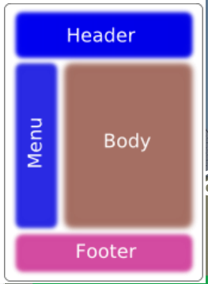
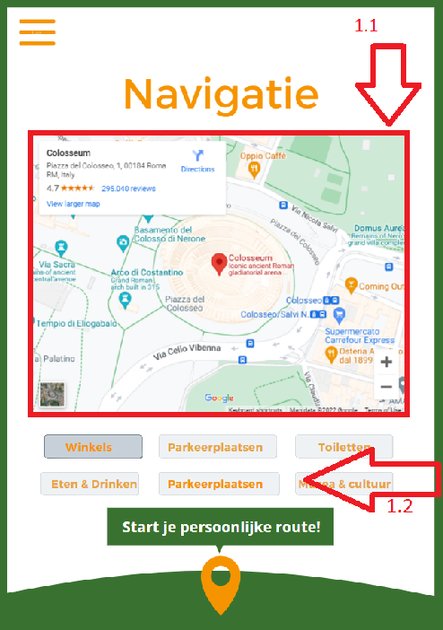
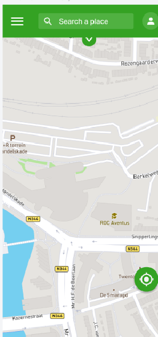
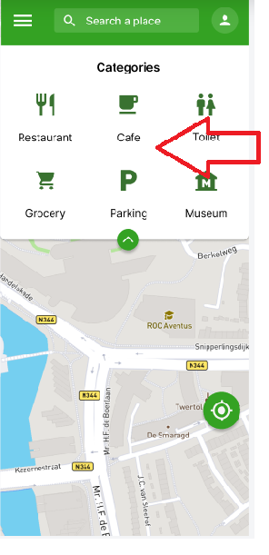
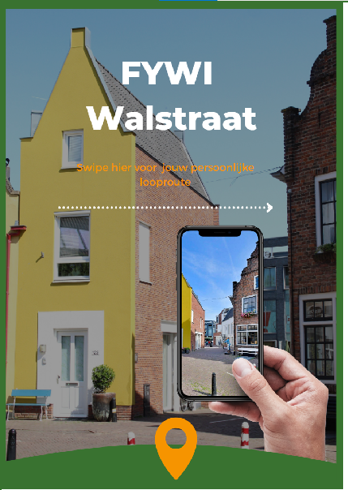
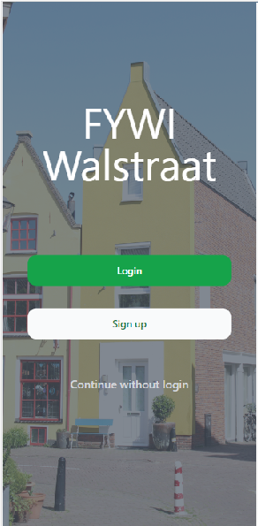

# Advice To Client

## Introduction
This paper outlines the main motivations behind the choice of tools, libraries, frameworks, and user interface design that were used in the development of this application. As well as recommendations for future use, optimization and development of this project.

## Advice to Client for Future
### App Platform
Although the client requested for a web application, after doing research we have realised that this project is most suitable to be a native application that uses Google Maps Andriod or Google Maps IOS API's. These API's not only have all functionality the JavaScript API has, but also has more tools for the map such as 3D camera, map rotation, real time location sharing, more zoom and pan control etc. Also native apps run faster which makes the user experience better.

### Timing for Building The Project

Excluding the inital 2 weeks of preperation and research, our team has a total of 3 sprints or 6 weeks to build the application. Although that is enough time to build the application with required basic functionality, it is adviced to spend more time for this application. The reason behind this is due to the app being so relied on the map and that Google Maps has much to offer. Customizing the map visiually in the map editor, heatmapping, map tilting, adding info windows to markers etc. are just a few things the API is capable of. These are all tools that have potential to improve the user experince and quality of the application. However, in a time frame of 6 weeks it is not possible to have this level of functionality.

### SSO Authentication

In this project authentication is done by Firebase, a backend multi-tool from Google. For signing up email/password is used. This is a common way for signing up to an application. However, Firebase has many options for authentication. These include signing up by SMS/Phone or Anonymous login which allows guest users to login temporarily. There are also options for external providers for sign in, such as signing in with Twitter, Google, Facebook, Microsoft etc. Thesedays, many people make use of these SSO options. Although we did not implement these features, these are viable options that can be done in the future.

### Intention of Replacing a Tourist Leaflet

 The client emphasized that the application intends to help people discover Deventer.  [Click here to see the project description in the POA. ](../project-docs/POA.md) The data that gets displayed on the application is manually input in the system via TheFeedFactory. Currently, some of the location descriptions are a bit generic such "place to get a drink". If the intention is to promote "discovering" then it is important to always have some unique facts about each location. Such as e.g "this building was built in 1861 by person xyz and was later converted into a pub".

 This will keep the users more interested and the app will fulfill its intention more. 

### User interface

To select the user interface, a design prepared by a group of “Smart Solution” students was used [Web app manual](assets/Handleiding_webapp.docx). The design developed by these students and approved by the client was suggested to be used as an inspiration, but further analysis of the proposed user interface design led the development team to the unanimous decision that this design needs to be adjusted. The main structure of the user interface was chosen to be classical, using the scheme from Figure 6.(Sema,2013)

Figure 6. Classic layout page structure

#### 1. Main page (Navigation page)

The main page, where the user will select a place to visit on the map and draw a trajectory/route to the destination, has been changed to a new version (Figure 2). In the new version, the map occupies the entire working surface, since the main interest and focus of the user is concentrated on the map. In addition, since the application is designed for use on a mobile phone, the old design (Figure 1-1.1) would lead to the fact that the size of the map would be inconvenient to use, since its approximate size would take up a third part of the already small size of the phone screen which may lead to inconvenience and dissatisfaction of the user.

Figure 1.

Figure 2.

#### 2. Categories
The buttons with the choice of destination categories (Figure 1-1.2)  in new version of Navigation page (Figure 3) are hidden in a retractable panel at the top under the header, also for the same reason, so as not to occupy the main working surface, but at the same time be easily accessible to the user. In addition, the retractable bar allows client to add new buttons for new categories without making any special changes to the main structure of the main page, if the client needs it in the future.

Figure 3.

#### 3. Header
When implementing the upper part of the screen (header), a preliminary study using Gerkules (2022),  was carried out on the topic of choosing the optimal size of this header, its height, choosing the size of the main button (burger menu ) was also chosen within investigation by Jin, Plocher, & Kiff, (2007) and Conradi, Busch & Alexander(2015) as 48px.(w-12 in tailwind) to make it comfortable to press while walking because future user will most probably use it during walking.
Further, the "search bar" field is also made not by chance, the developers previewed the required minimum font size which is 16 px (Kennedy, 2021), for the convenience of the user and assigned font-size as 18 px. The sizes of the other buttons had to be between 42px and 48px , according to Jin, Plocher, & Kiff, (2007) , thus the size of the category buttons was chosen taking into account the new design and a preliminary study of the required size of the secondary buttons.

#### 4. First page and login page
The Smart Solution students team suggested using multiple screens to log in and use the app. The developers at the general discussion decided to remove the first screen (Figure 4), which it did not carry any functions other than a greeting and further scrolling through it as unnecessary. Thus, first page was implemented in new version which can carry few functionality with choice: login, sign in or continue without registration (Figure 5).
Moreover, since the application itself can be used without prior registration, it would probably be reasonable in the future to set the main screen with map (navigation page, Figure 2) as the very beginning one that will open immediately, while at the same time, if the user wants to register or log into his account, he can always quickly proceed to this process with using the account shortcut button located in the upper right corner (Figure 3)

Figure 4.

Figure 5.

## Advice Based On Test Results 
This section gives advice based on testing done by Smart Solution Students which was conducted on 21 June, 2022. Before reading this section please see [the Testing FYWI PDF. ](../../pdf/project-docs/Testing%20FYWI.pdf)

### App Performance

### Personalization of Routes

### Referenses:

1. Gerkules, M.(2022, June 08)."Website Header Design in 2022: Examples & Best Practices": onElementor Team WritesWeb Design.
      Retrieved from: https://elementor.com/blog/website-header-design/

2. Jin, Zhao & Plocher, Tom & Kiff, Liana. (2007). Touch Screen User Interfaces for Older    Adults: Button Size and Spacing. Lecture Notes in Computer Science. 4554. 933-941. 10.1007/978-3-540-73279-2_104.

3. Kennedy,E.D.(2021)."Font Sizes in UI Design": The Complete Guide.
      Retrieved from https://learnui.design/blog/mobile-desktop-website-font-size-guidelines.html 

4. Sema,H.D.(2013).Mobile-friendly web design and development:KEMI-TORNIO UNIVERSITY OF APPLIED SCIENCES
TECHNOLOGY Retrieved from:https://www.theseus.fi/bitstream/handle/10024/54480/Heyiredin_DanielSema.pdf?sequence=1&isAllowed=y
5. Conradi, Jessica & Busch, Olivia & Alexander, Thomas. (2015). Optimal Touch Button Size for the use of Mobile Devices while Walking. Procedia Manufacturing. 3. 387-394. 10.1016/j.promfg.2015.07.182. 

